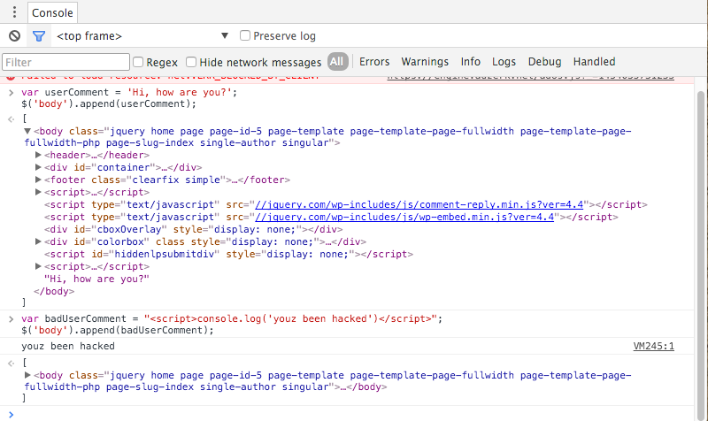
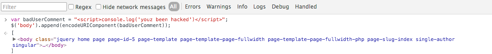

I recently built a simple chat client (I know, I'm recreating late '90's tech!) and in order to make my chat application safer, I needed to prevent XSS attacks using HTML escaping. To start, I had no idea what the frack an XSS attack was, much less how to utilize HTML escaping to prevent one.

After a bit of research, I learned that an XSS attack, or cross-site scripting is a common type of hack where a user (likely malicious) attempts to upload a script onto a website. How does that look in the real world?

In my project, my peers attempted to "hack" my chat client by sending user messages (which the chat client received via AJAX). If one of those comments was simply: “hey what’s up Jordan, you’re the coolest dude that lives in your house”, then that would render on the website easily enough. However, if the comment contained a script tag, like this: `<script src=‘dobad stuff’> </script>`, what would happen?

##The Bad News
If the JavaScript didn’t escape the HTML, that script would have run on my page. There are lots of forms this specific script injection could take, and I won’t endeavor to describe them in detail. Check out [OWASP](https://www.owasp.org/index.php/Cross-site_Scripting_(XSS)) for an in-depth analysis on the most common types of script attacks. Suffice to say, it's easy to visualize how such a script could harm other users loading that message, potentially grabbing vital information from their client via cookies and other mechanisms.

Real quick, here is what this might look at (first with an error-free example):

```javascript
var userComment = 'Hi, how are you?';
$('body').append(userComment);
//now the userComment is a child of the body
```
And now for an example where the `userComment` isn't a simple collection of letters and the most common punctuation, but instead a script, like so:

```javascript
var badUserComment = "<script>console.log('youz been hacked')</script>";
$('body').append(badUserComment);
```
Here's what that does in a page which has jQuery loaded:



Because I didn't escape the `badUserComment`, when JavaScript (in this case, using jQuery) attempts to append the comment to the body, it ends up executing the code. Right now, the `badUserComment` console logs an innocuous comment, but it's easy to ease how this technique might be used to execute much more malicious attacks.

##HTML Escaping to the Rescue
In order to prevent this specific type of attack, you need to properly escape certain characters of the content that is going to be added to the DOM. As a refresher, most programming languages allow for escaping characters that might cause hangups for the interpreter. In JavaScript, I could escape a new line in a string by adding `/n` so that the new line appears where intended. `'Q:Hi, how are you Susy? /n A:I am fine'`. To learn more about what characters need escaping in JavaScript in order for JavaScript to behave as expected, check out the [Mozilla Developer Network](https://msdn.microsoft.com/en-us/library/2yfce773(v=vs.94).aspx).

Okay, so how does this work when putting HTML in the DOM? I googled around a bit, and after crawling through too many pages with incomplete answers, I figured out how HTML escaping works.

##The Nitty, the Gritty, Welcome to Escape City

In order to prevent this attack, the HTML being added to the page needs to be escaped for certain characters in a similar way as JavaScript. Since we are using JavaScript to process the content we are adding to the DOM, we can first run a regex test which checks if any characters in the content to be added matches one of the most common offenders hackers use for XSS attacks. The frequently used characters that need to be tested for are: `<`, `>`, `'`, `"`, and `&`, and many would argue you should escape any characters with a character code above 127 (meaning everything that isn't a normal letter or number). Then you replace those characters with their HTML URL encoded equivalent. For ampersand, this would be `&amp`, for `<` this is `&lt`, so on and so forth.

If this sounds tedious to you, then that's good, because it's not advisable for you to manually run your own homegrown regex checking function to replace the necessary characters in HTML on your own. Google itself recommends a few alternatives, largely encouraging developers to utilize libraries, but I'll point out the easiest ones I encountered. Also, please note, as all articles like these make sure to point out, this is not an exhaustive list of ways to prevent XSS attacks, but rather a general primer on the topic.

The first 'escaping' utility I encountered appeared in Underscore.JS, and it worked much like the example I explained by running a regex over the most common offenders. Underscore also offers a mini-templating service which will take care of this as well. Other, more dedicated templating services such as a Handlebars.JS and Mustache.JS serve as more robust options which take care of a lot more than escaping, but they do escape as well.

However, as I was researching, I kept thinking 'Surely JavaScript features a native utitility?' Turns out it does. encodeURIComponent will work in a pinch. According to [MDN](https://developer.mozilla.org/en-US/docs/Web/JavaScript/Reference/Global_Objects/encodeURIComponent), it HTML URL encodes everything except "alphabetic, decimal digits, - _ . ! ~ * ' ( )". Obviously, since this does not encode `'`, it's not the most complete solution, a factor which should not be discounted. At the very least, it now fixes my `badUserComment`.


